# Purchase Module: Flowcharts and Relationship Diagrams

Visual companion to [PURCHASE_MODULE_DATABASE_RELATIONSHIP_MAP.md](PURCHASE_MODULE_DATABASE_RELATIONSHIP_MAP.md). The relationship IDs (R01, C02, S03 and so on) refer to that file's relationship register. Job Work is excluded.

All table and column names are the real ones from `schema.sql` and the live database `sms_seals`. Every edge was confirmed in code or in the live database; nothing is assumed.

## Legend

| In flowcharts | In ER diagrams | Meaning |
|---|---|---|
| `──── FK ...` solid arrow, label starts with **FK** | solid line `──` | Actual PostgreSQL foreign key |
| `- - - ...` dotted arrow, label starts with **LOGICAL** / **SNAPSHOT** / **JSON** / **QTY** | dotted line `‥` | Application-level relationship (lookup, validation, value join, copied value, quantity mirror, key inside JSON). No DB constraint |
| `═══` thick arrow | n/a | Business data flow (a step writes rows) |
| **JOIN** in a label | `JOIN` in a label | The pair is also joined in backend SQL |

No JPA/Hibernate associations exist in the Purchase Module, so none are drawn. See §1 of the relationship map.

Contents:
1. [Complete module map](#1-complete-module-map)
2. [End-to-end business data flow](#2-end-to-end-business-data-flow)
3. [Standard procurement ER (PR → Draft → PO → GRN)](#3-standard-procurement-er)
4. [Masters, vendor items and rates](#4-masters-vendor-items-and-rates)
5. [PO satellites: terms, schedules, milestones, audit](#5-po-satellites)
6. [Quantity flow across tables](#6-quantity-flow-across-tables)
7. [Transaction sequences: draft conversion and GRN posting](#7-transaction-sequences)
8. [RFQ and quotations](#8-rfq-and-quotations)
9. [Capital PO](#9-capital-po)
10. [Service PO](#10-service-po)
11. [Numbering and audit](#11-numbering-and-audit)
12. [Reporting flows](#12-reporting-flows)

---

## 1. Complete module map

Every table in the Purchase Module and the key that connects it. Detailed columns are in the diagrams that follow.

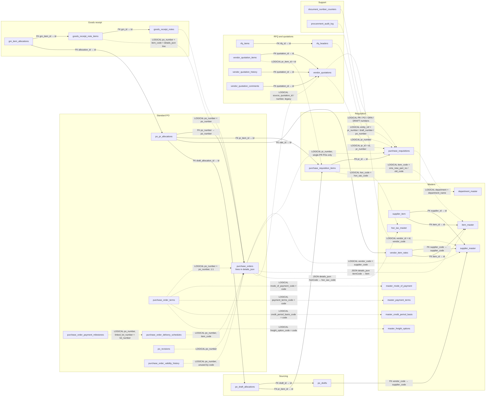
```mermaid
flowchart LR
  subgraph MASTERS["Masters"]
    SM[supplier_master]
    SI[supplier_item]
    IM[item_master]
    DM[department_master]
    HSN[hsn_tax_master]
    VIR[vendor_item_rates]
    MOP[master_mode_of_payment]
    MPT[master_payment_terms]
    MCP[master_credit_period_basis]
    MFO[master_freight_options]
  end

  subgraph REQ["Requisition"]
    PR[purchase_requisitions]
    PRI[purchase_requisition_items]
  end

  subgraph SRC["Sourcing"]
    PD[po_drafts]
    PDA[po_draft_allocations]
  end

  subgraph PO["Standard PO"]
    POH["purchase_orders<br/>lines in details_json"]
    PPA[po_pr_allocations]
    POT[purchase_order_terms]
    PODS[purchase_order_delivery_schedules]
    POPM[purchase_order_payment_milestones]
    PORV[po_revisions]
    POVH[purchase_order_validity_history]
  end

  subgraph RCV["Goods receipt"]
    GRN[goods_receipt_notes]
    GRNI[goods_receipt_note_items]
    GIA[grn_item_allocations]
  end

  subgraph RFQQ["RFQ and quotations"]
    RFQ[rfq_headers]
    RFQI[rfq_items]
    VQ[vendor_quotations]
    VQI[vendor_quotation_items]
    VQH[vendor_quotation_history]
    VQC[vendor_quotation_comments]
  end

  subgraph SUP["Support"]
    DNC[document_number_counters]
    PAL[procurement_audit_log]
  end

  SI -- "FK supplier_id → id" --> SM
  SI -- "FK item_id → id" --> IM
  VIR -- "FK supplier_code → supplier_code" --> SM
  VIR -- "FK item_id → id" --> IM

  PRI -- "FK pr_id → id" --> PR
  PR -. "LOGICAL department = department_name" .-> DM
  PRI -. "LOGICAL item_code = sms_new_part_no / old_code" .-> IM
  PRI -. "LOGICAL hsn_code = hsn_sac_code" .-> HSN

  PD -- "FK vendor_code → supplier_code" --> SM
  PDA -- "FK draft_id → id" --> PD
  PDA -- "FK pr_item_id → id" --> PRI

  POH -. "LOGICAL vendor_code = supplier_code" .-> SM
  POH -. "LOGICAL pr_number, single-PR POs only" .-> PR
  POH -. "JSON details_json itemCode → item" .-> IM
  POH -. "JSON details_json hsnCode → hsn_sac_code" .-> HSN
  PPA -- "FK po_number → po_number" --> POH
  PPA -- "FK pr_item_id → id" --> PRI
  PPA -- "FK rate_id → id" --> VIR
  PPA -- "FK draft_allocation_id → id" --> PDA
  POT -. "LOGICAL po_number = po_number, 1:1" .-> POH
  POT -. "LOGICAL mode_of_payment_code = code" .-> MOP
  POT -. "LOGICAL payment_terms_code = code" .-> MPT
  POT -. "LOGICAL credit_period_basis_code = code" .-> MCP
  POT -. "LOGICAL freight_option_code = code" .-> MFO
  PODS -. "LOGICAL po_number, item_code" .-> POH
  POPM -. "LOGICAL po_number, linked_lot_number = lot_number" .-> PODS
  PORV -. "LOGICAL po_number" .-> POH
  POVH -. "LOGICAL po_number, unused by code" .-> POH

  GRNI -- "FK grn_id → id" --> GRN
  GRN -. "LOGICAL po_number = po_number" .-> POH
  GRNI -. "LOGICAL po_number + item_code = details_json line" .-> POH
  GIA -- "FK grn_item_id → id" --> GRNI
  GIA -- "FK allocation_id → id" --> PPA

  RFQI -- "FK rfq_id → id" --> RFQ
  RFQ -. "LOGICAL pr_number" .-> PR
  VQI -- "FK quotation_id → id" --> VQ
  VQH -- "FK quotation_id → id" --> VQ
  VQC -- "FK quotation_id → id" --> VQ
  VQ -. "LOGICAL vendor_id = id, vendor_code" .-> SM
  VQ -. "LOGICAL pr_id = id, pr_number" .-> PR
  VQI -. "LOGICAL pr_item_id = id" .-> PRI
  POH -. "LOGICAL source_quotation_id / number, legacy" .-> VQ

  DNC -. "LOGICAL PR / PO / GRN / DRAFT numbers" .-> PR
  PAL -. "LOGICAL entity_ref = pr_number / draft_number / po_number" .-> PR
```

Capital PO and Service PO have their own table families. They link to the shared tables only as shown here (details in §9 and §10):

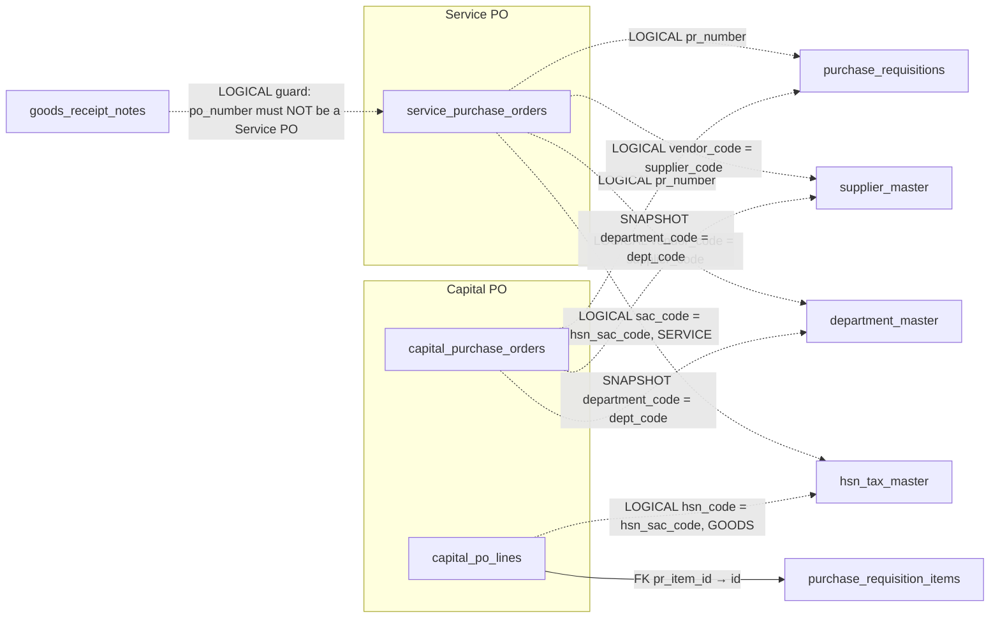
```mermaid
flowchart LR
  subgraph CAP["Capital PO"]
    CPO[capital_purchase_orders]
    CPL[capital_po_lines]
  end
  subgraph SRV["Service PO"]
    SPO[service_purchase_orders]
  end
  PRI[purchase_requisition_items]
  PR[purchase_requisitions]
  SM[supplier_master]
  DM[department_master]
  HSN[hsn_tax_master]
  GRN[goods_receipt_notes]

  CPL -- "FK pr_item_id → id" --> PRI
  CPO -. "LOGICAL pr_number" .-> PR
  CPO -. "LOGICAL vendor_code = supplier_code" .-> SM
  CPO -. "SNAPSHOT department_code = dept_code" .-> DM
  CPL -. "LOGICAL hsn_code = hsn_sac_code, GOODS" .-> HSN
  SPO -. "LOGICAL pr_number" .-> PR
  SPO -. "LOGICAL vendor_code = supplier_code" .-> SM
  SPO -. "SNAPSHOT department_code = dept_code" .-> DM
  SPO -. "LOGICAL sac_code = hsn_sac_code, SERVICE" .-> HSN
  GRN -. "LOGICAL guard: po_number must NOT be a Service PO" .-> SPO
```

---

## 2. End-to-end business data flow

The standard (stock) purchase flow, with the tables each step writes. Thick arrows show the business flow; plain arrows show the tables a step writes.

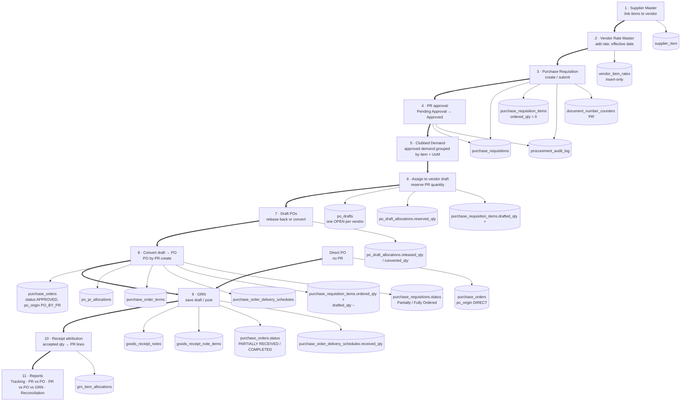
```mermaid
flowchart TD
  A["1 · Supplier Master<br/>link items to vendor"] ==> B["2 · Vendor Rate Master<br/>add rate, effective date"]
  B ==> C["3 · Purchase Requisition<br/>create / submit"]
  C ==> D["4 · PR approval<br/>Pending Approval → Approved"]
  D ==> E["5 · Clubbed Demand<br/>approved demand grouped by item + UoM"]
  E ==> F["6 · Assign to vendor draft<br/>reserve PR quantity"]
  F ==> G["7 · Draft POs<br/>release back or convert"]
  G ==> H["8 · Convert draft → PO<br/>PO by PR create"]
  H ==> I["9 · GRN<br/>save draft / post"]
  I ==> J["10 · Receipt attribution<br/>accepted qty → PR lines"]
  J ==> K["11 · Reports<br/>Tracking · PR vs PO · PR vs PO vs GRN · Reconciliation"]

  X["Direct PO<br/>no PR"] ==> I

  A --> SI[("supplier_item")]
  B --> VIR[("vendor_item_rates<br/>insert-only")]
  C --> PR[("purchase_requisitions")]
  C --> PRI[("purchase_requisition_items<br/>ordered_qty = 0")]
  C --> PAL[("procurement_audit_log")]
  C --> DNC[("document_number_counters 'PR'")]
  D --> PR
  D --> PAL
  F --> PD[("po_drafts<br/>one OPEN per vendor")]
  F --> PDA[("po_draft_allocations.reserved_qty")]
  F --> PRIdq[("purchase_requisition_items.drafted_qty +")]
  G --> PDA2[("po_draft_allocations.released_qty / converted_qty")]
  H --> POH[("purchase_orders<br/>status APPROVED, po_origin PO_BY_PR")]
  H --> PPA[("po_pr_allocations")]
  H --> POT[("purchase_order_terms")]
  H --> PODS[("purchase_order_delivery_schedules")]
  H --> PRIoq[("purchase_requisition_items.ordered_qty +<br/>drafted_qty −")]
  H --> PRst[("purchase_requisitions.status<br/>Partially / Fully Ordered")]
  X --> POHd[("purchase_orders<br/>po_origin DIRECT")]
  I --> GRN[("goods_receipt_notes")]
  I --> GRNI[("goods_receipt_note_items")]
  I --> POst[("purchase_orders.status<br/>PARTIALLY RECEIVED / COMPLETED")]
  I --> PODSr[("purchase_order_delivery_schedules.received_qty")]
  J --> GIA[("grn_item_allocations")]
```

Steps 1, 2 and 5 are prerequisites that the backend checks. A vendor appears in Clubbed Demand only if it is ACTIVE, has a `supplier_item` row for the item and has a `vendor_item_rates` row effective today (`SourcingService.java:280-301`).

---

## 3. Standard procurement ER

Solid line = actual FK. Dotted line = logical relationship.

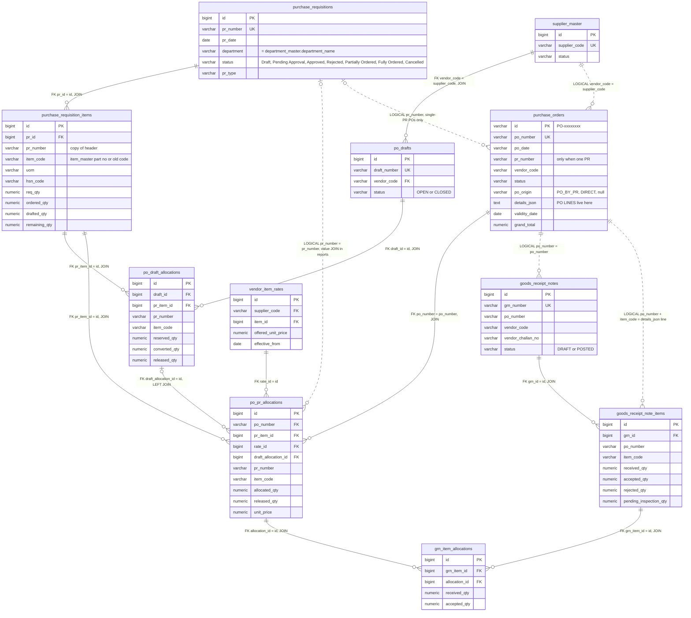
```mermaid
erDiagram
  purchase_requisitions {
    bigint id PK
    varchar pr_number UK
    date pr_date
    varchar department "= department_master.department_name"
    varchar status "Draft, Pending Approval, Approved, Rejected, Partially Ordered, Fully Ordered, Cancelled"
    varchar pr_type
  }
  purchase_requisition_items {
    bigint id PK
    bigint pr_id FK
    varchar pr_number "copy of header"
    varchar item_code "item_master part no or old code"
    varchar uom
    varchar hsn_code
    numeric req_qty
    numeric ordered_qty
    numeric drafted_qty
    numeric remaining_qty
  }
  po_drafts {
    bigint id PK
    varchar draft_number UK
    varchar vendor_code FK
    varchar status "OPEN or CLOSED"
  }
  po_draft_allocations {
    bigint id PK
    bigint draft_id FK
    bigint pr_item_id FK
    varchar pr_number
    varchar item_code
    numeric reserved_qty
    numeric converted_qty
    numeric released_qty
  }
  purchase_orders {
    varchar id PK "PO-xxxxxxxx"
    varchar po_number UK
    varchar po_date
    varchar pr_number "only when one PR"
    varchar vendor_code
    varchar status
    varchar po_origin "PO_BY_PR, DIRECT, null"
    text details_json "PO LINES live here"
    date validity_date
    numeric grand_total
  }
  po_pr_allocations {
    bigint id PK
    varchar po_number FK
    bigint pr_item_id FK
    bigint rate_id FK
    bigint draft_allocation_id FK
    varchar pr_number
    varchar item_code
    numeric allocated_qty
    numeric released_qty
    numeric unit_price
  }
  goods_receipt_notes {
    bigint id PK
    varchar grn_number UK
    varchar po_number
    varchar vendor_code
    varchar vendor_challan_no
    varchar status "DRAFT or POSTED"
  }
  goods_receipt_note_items {
    bigint id PK
    bigint grn_id FK
    varchar po_number
    varchar item_code
    numeric received_qty
    numeric accepted_qty
    numeric rejected_qty
    numeric pending_inspection_qty
  }
  grn_item_allocations {
    bigint id PK
    bigint grn_item_id FK
    bigint allocation_id FK
    numeric received_qty
    numeric accepted_qty
  }
  vendor_item_rates {
    bigint id PK
    varchar supplier_code FK
    bigint item_id FK
    numeric offered_unit_price
    date effective_from
  }
  supplier_master {
    bigint id PK
    varchar supplier_code UK
    varchar status
  }

  purchase_requisitions ||--o{ purchase_requisition_items : "FK pr_id = id, JOIN"
  supplier_master ||--o{ po_drafts : "FK vendor_code = supplier_code, JOIN"
  po_drafts ||--o{ po_draft_allocations : "FK draft_id = id, JOIN"
  purchase_requisition_items ||--o{ po_draft_allocations : "FK pr_item_id = id, JOIN"
  purchase_orders ||--o{ po_pr_allocations : "FK po_number = po_number, JOIN"
  purchase_requisition_items ||--o{ po_pr_allocations : "FK pr_item_id = id, JOIN"
  vendor_item_rates ||--o{ po_pr_allocations : "FK rate_id = id"
  po_draft_allocations |o--o{ po_pr_allocations : "FK draft_allocation_id = id, LEFT JOIN"
  goods_receipt_notes ||--o{ goods_receipt_note_items : "FK grn_id = id, JOIN"
  goods_receipt_note_items ||--o{ grn_item_allocations : "FK grn_item_id = id, JOIN"
  po_pr_allocations ||--o{ grn_item_allocations : "FK allocation_id = id, JOIN"
  purchase_requisitions |o..o{ po_pr_allocations : "LOGICAL pr_number = pr_number, value JOIN in reports"
  purchase_requisitions |o..o{ purchase_orders : "LOGICAL pr_number, single-PR POs only"
  supplier_master ||..o{ purchase_orders : "LOGICAL vendor_code = supplier_code"
  purchase_orders ||..o{ goods_receipt_notes : "LOGICAL po_number = po_number"
  purchase_orders ||..o{ goods_receipt_note_items : "LOGICAL po_number + item_code = details_json line"
```

**Indirect paths used by the backend:**

| From | To | Path |
|---|---|---|
| GRN line | PR line | `goods_receipt_note_items.id` → `grn_item_allocations.grn_item_id` → `.allocation_id` → `po_pr_allocations.id` → `.pr_item_id` → `purchase_requisition_items.id` |
| PO | PR header(s) | `purchase_orders.po_number` → `po_pr_allocations.po_number` → `.pr_item_id` → `purchase_requisition_items.pr_id` → `purchase_requisitions.id` (reports use `po_pr_allocations.pr_number = purchase_requisitions.pr_number`) |
| PO | Draft | `purchase_orders.po_number` → `po_pr_allocations.draft_allocation_id` → `po_draft_allocations.draft_id` → `po_drafts.id` |
| PO | Vendor rate used | `purchase_orders.po_number` → `po_pr_allocations.rate_id` → `vendor_item_rates.id` |
| PR line | Vendor | `purchase_requisition_items.id` → `po_draft_allocations` → `po_drafts.vendor_code`, or → `po_pr_allocations` → `purchase_orders.vendor_code` |

---

## 4. Masters, vendor items and rates

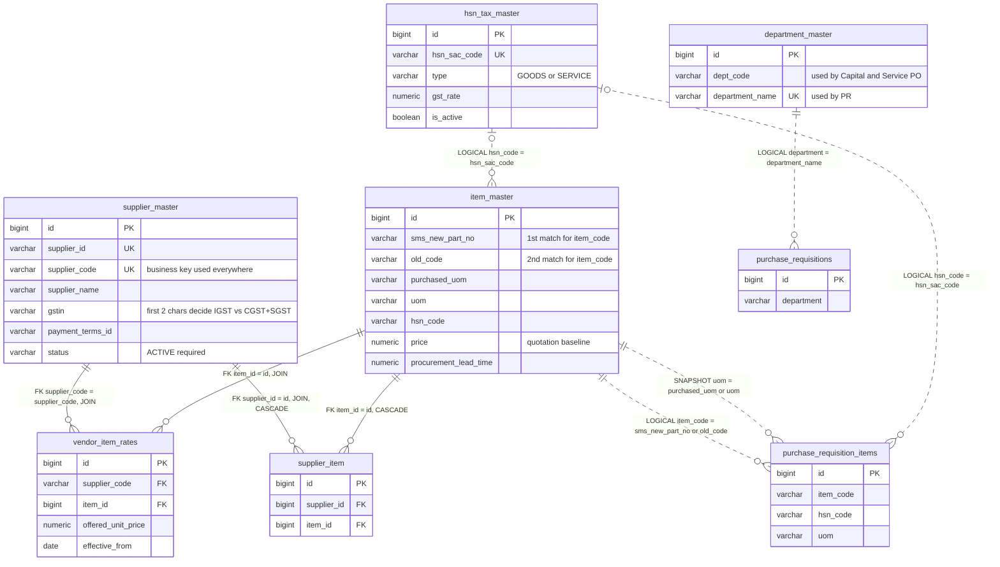
```mermaid
erDiagram
  supplier_master {
    bigint id PK
    varchar supplier_id UK
    varchar supplier_code UK "business key used everywhere"
    varchar supplier_name
    varchar gstin "first 2 chars decide IGST vs CGST+SGST"
    varchar payment_terms_id
    varchar status "ACTIVE required"
  }
  supplier_item {
    bigint id PK
    bigint supplier_id FK
    bigint item_id FK
  }
  item_master {
    bigint id PK
    varchar sms_new_part_no "1st match for item_code"
    varchar old_code "2nd match for item_code"
    varchar purchased_uom
    varchar uom
    varchar hsn_code
    numeric price "quotation baseline"
    numeric procurement_lead_time
  }
  vendor_item_rates {
    bigint id PK
    varchar supplier_code FK
    bigint item_id FK
    numeric offered_unit_price
    date effective_from
  }
  hsn_tax_master {
    bigint id PK
    varchar hsn_sac_code UK
    varchar type "GOODS or SERVICE"
    numeric gst_rate
    boolean is_active
  }
  department_master {
    bigint id PK
    varchar dept_code "used by Capital and Service PO"
    varchar department_name UK "used by PR"
  }
  purchase_requisitions {
    bigint id PK
    varchar department
  }
  purchase_requisition_items {
    bigint id PK
    varchar item_code
    varchar hsn_code
    varchar uom
  }

  supplier_master ||--o{ supplier_item : "FK supplier_id = id, JOIN, CASCADE"
  item_master ||--o{ supplier_item : "FK item_id = id, CASCADE"
  supplier_master ||--o{ vendor_item_rates : "FK supplier_code = supplier_code, JOIN"
  item_master ||--o{ vendor_item_rates : "FK item_id = id, JOIN"
  item_master ||..o{ purchase_requisition_items : "LOGICAL item_code = sms_new_part_no or old_code"
  item_master ||..o{ purchase_requisition_items : "SNAPSHOT uom = purchased_uom or uom"
  hsn_tax_master |o..o{ purchase_requisition_items : "LOGICAL hsn_code = hsn_sac_code"
  hsn_tax_master |o..o{ item_master : "LOGICAL hsn_code = hsn_sac_code"
  department_master ||..o{ purchase_requisitions : "LOGICAL department = department_name"
```

**How a vendor suggestion and a PO price are found** (`SourcingService.vendorOptions`, `VendorRateService.effectiveRate`):

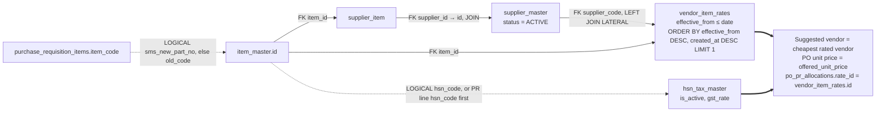
```mermaid
flowchart LR
  PRI["purchase_requisition_items.item_code"] -. "LOGICAL sms_new_part_no, else old_code" .-> IM["item_master.id"]
  IM -- "FK item_id" --> SI["supplier_item"]
  SI -- "FK supplier_id → id, JOIN" --> SM["supplier_master<br/>status = ACTIVE"]
  SM -- "FK supplier_code, LEFT JOIN LATERAL" --> VIR["vendor_item_rates<br/>effective_from ≤ date<br/>ORDER BY effective_from DESC, created_at DESC LIMIT 1"]
  IM -- "FK item_id" --> VIR
  VIR ==> OUT["Suggested vendor = cheapest rated vendor<br/>PO unit price = offered_unit_price<br/>po_pr_allocations.rate_id = vendor_item_rates.id"]
  IM -. "LOGICAL hsn_code, or PR line hsn_code first" .-> HSN["hsn_tax_master<br/>is_active, gst_rate"]
  HSN ==> OUT
```

---

## 5. PO satellites

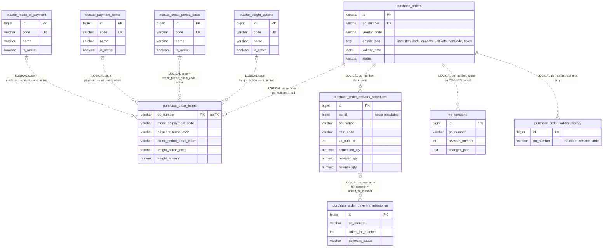
```mermaid
erDiagram
  purchase_orders {
    varchar id PK
    varchar po_number UK
    varchar vendor_code
    text details_json "lines: itemCode, quantity, unitRate, hsnCode, taxes"
    date validity_date
    varchar status
  }
  purchase_order_terms {
    varchar po_number PK "no FK"
    varchar mode_of_payment_code
    varchar payment_terms_code
    varchar credit_period_basis_code
    varchar freight_option_code
    numeric freight_amount
  }
  master_mode_of_payment {
    bigint id PK
    varchar code UK
    varchar name
    boolean is_active
  }
  master_payment_terms {
    bigint id PK
    varchar code UK
    varchar name
    boolean is_active
  }
  master_credit_period_basis {
    bigint id PK
    varchar code UK
    varchar name
    boolean is_active
  }
  master_freight_options {
    bigint id PK
    varchar code UK
    varchar name
    boolean is_active
  }
  purchase_order_delivery_schedules {
    bigint id PK
    bigint po_id "never populated"
    varchar po_number
    varchar item_code
    int lot_number
    numeric scheduled_qty
    numeric received_qty
    numeric balance_qty
  }
  purchase_order_payment_milestones {
    bigint id PK
    varchar po_number
    int linked_lot_number
    varchar payment_status
  }
  po_revisions {
    bigint id PK
    varchar po_number
    int revision_number
    text changes_json
  }
  purchase_order_validity_history {
    bigint id PK
    varchar po_number "no code uses this table"
  }

  purchase_orders ||..o| purchase_order_terms : "LOGICAL po_number = po_number, 1 to 1"
  master_mode_of_payment |o..o{ purchase_order_terms : "LOGICAL code = mode_of_payment_code, active"
  master_payment_terms |o..o{ purchase_order_terms : "LOGICAL code = payment_terms_code, active"
  master_credit_period_basis |o..o{ purchase_order_terms : "LOGICAL code = credit_period_basis_code, active"
  master_freight_options |o..o{ purchase_order_terms : "LOGICAL code = freight_option_code, active"
  purchase_orders ||..o{ purchase_order_delivery_schedules : "LOGICAL po_number, item_code"
  purchase_order_delivery_schedules |o..o{ purchase_order_payment_milestones : "LOGICAL po_number + lot_number = linked_lot_number"
  purchase_orders ||..o{ po_revisions : "LOGICAL po_number, written on PO-by-PR cancel"
  purchase_orders ||..o{ purchase_order_validity_history : "LOGICAL po_number, schema only"
```

---

## 6. Quantity flow across tables

How one unit of PR quantity moves. Each box is a column, and every move happens inside a single transaction under row locks.

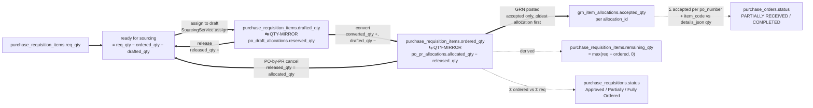
```mermaid
flowchart LR
  REQ["purchase_requisition_items.req_qty"] ==> READY["ready for sourcing<br/>= req_qty − ordered_qty − drafted_qty"]
  READY == "assign to draft<br/>SourcingService.assign" ==> DRAFTED["purchase_requisition_items.drafted_qty<br/>⇆ QTY-MIRROR<br/>po_draft_allocations.reserved_qty"]
  DRAFTED == "release<br/>released_qty +" ==> READY
  DRAFTED == "convert<br/>converted_qty +, drafted_qty −" ==> ORDERED["purchase_requisition_items.ordered_qty<br/>⇆ QTY-MIRROR<br/>po_pr_allocations.allocated_qty − released_qty"]
  ORDERED == "PO-by-PR cancel<br/>released_qty = allocated_qty" ==> READY
  ORDERED == "GRN posted<br/>accepted only, oldest allocation first" ==> RECEIVED["grn_item_allocations.accepted_qty<br/>per allocation_id"]
  ORDERED -. "derived" .-> REM["purchase_requisition_items.remaining_qty<br/>= max(req − ordered, 0)"]
  ORDERED -. "Σ ordered vs Σ req" .-> PRS["purchase_requisitions.status<br/>Approved / Partially / Fully Ordered"]
  RECEIVED -. "Σ accepted per po_number + item_code vs details_json qty" .-> POS["purchase_orders.status<br/>PARTIALLY RECEIVED / COMPLETED"]
```

---

## 7. Transaction sequences

### 7.1 Convert a vendor draft into a PO (`POST /api/new-po/sourcing/drafts/{draft}/convert`)

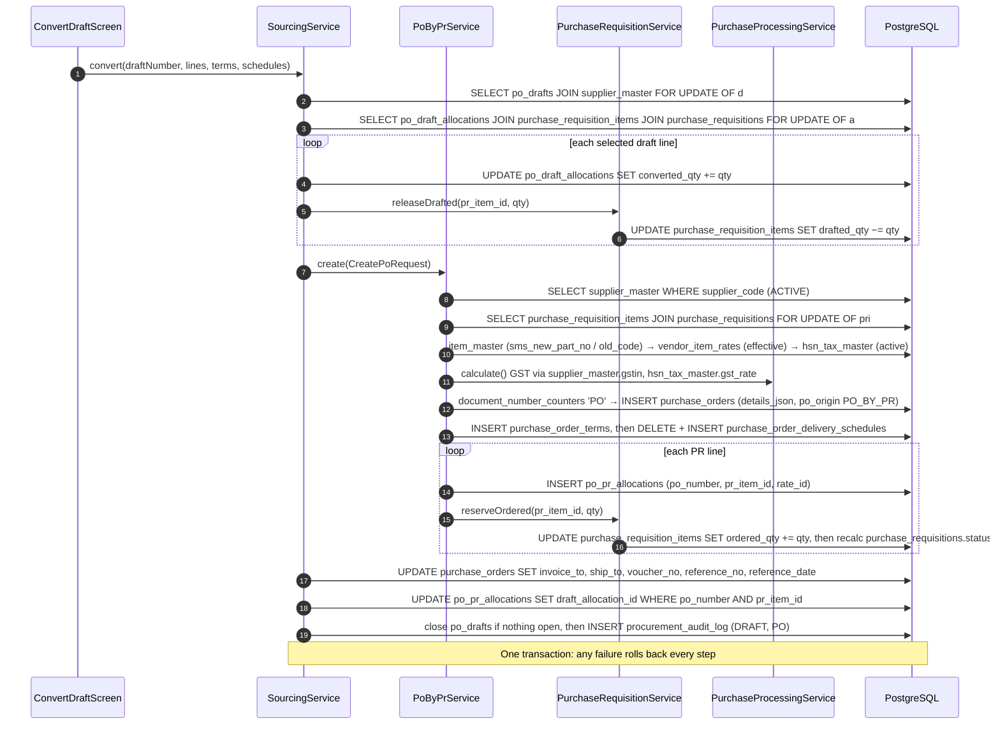
```mermaid
sequenceDiagram
  autonumber
  participant UI as ConvertDraftScreen
  participant SS as SourcingService
  participant PB as PoByPrService
  participant PRS as PurchaseRequisitionService
  participant PPS as PurchaseProcessingService
  participant DB as PostgreSQL

  UI->>SS: convert(draftNumber, lines, terms, schedules)
  SS->>DB: SELECT po_drafts JOIN supplier_master FOR UPDATE OF d
  SS->>DB: SELECT po_draft_allocations JOIN purchase_requisition_items JOIN purchase_requisitions FOR UPDATE OF a
  loop each selected draft line
    SS->>DB: UPDATE po_draft_allocations SET converted_qty += qty
    SS->>PRS: releaseDrafted(pr_item_id, qty)
    PRS->>DB: UPDATE purchase_requisition_items SET drafted_qty −= qty
  end
  SS->>PB: create(CreatePoRequest)
  PB->>DB: SELECT supplier_master WHERE supplier_code (ACTIVE)
  PB->>DB: SELECT purchase_requisition_items JOIN purchase_requisitions FOR UPDATE OF pri
  PB->>DB: item_master (sms_new_part_no / old_code) → vendor_item_rates (effective) → hsn_tax_master (active)
  PB->>PPS: calculate() GST via supplier_master.gstin, hsn_tax_master.gst_rate
  PB->>DB: document_number_counters 'PO' → INSERT purchase_orders (details_json, po_origin PO_BY_PR)
  PB->>DB: INSERT purchase_order_terms, then DELETE + INSERT purchase_order_delivery_schedules
  loop each PR line
    PB->>DB: INSERT po_pr_allocations (po_number, pr_item_id, rate_id)
    PB->>PRS: reserveOrdered(pr_item_id, qty)
    PRS->>DB: UPDATE purchase_requisition_items SET ordered_qty += qty, then recalc purchase_requisitions.status
  end
  SS->>DB: UPDATE purchase_orders SET invoice_to, ship_to, voucher_no, reference_no, reference_date
  SS->>DB: UPDATE po_pr_allocations SET draft_allocation_id WHERE po_number AND pr_item_id
  SS->>DB: close po_drafts if nothing open, then INSERT procurement_audit_log (DRAFT, PO)
  Note over SS,DB: One transaction: any failure rolls back every step
```

### 7.2 Post a GRN (`POST /api/purchase/grn/{id}/post` or `POST /api/purchase/grn?post=true`)

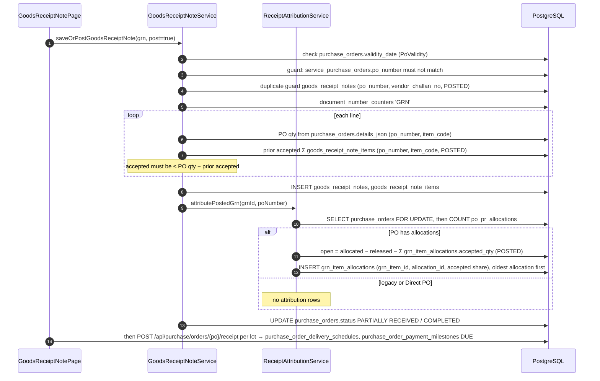
```mermaid
sequenceDiagram
  autonumber
  participant UI as GoodsReceiptNotePage
  participant G as GoodsReceiptNoteService
  participant RA as ReceiptAttributionService
  participant DB as PostgreSQL

  UI->>G: saveOrPostGoodsReceiptNote(grn, post=true)
  G->>DB: check purchase_orders.validity_date (PoValidity)
  G->>DB: guard: service_purchase_orders.po_number must not match
  G->>DB: duplicate guard goods_receipt_notes (po_number, vendor_challan_no, POSTED)
  G->>DB: document_number_counters 'GRN'
  loop each line
    G->>DB: PO qty from purchase_orders.details_json (po_number, item_code)
    G->>DB: prior accepted Σ goods_receipt_note_items (po_number, item_code, POSTED)
    Note over G: accepted must be ≤ PO qty − prior accepted
  end
  G->>DB: INSERT goods_receipt_notes, goods_receipt_note_items
  G->>RA: attributePostedGrn(grnId, poNumber)
  RA->>DB: SELECT purchase_orders FOR UPDATE, then COUNT po_pr_allocations
  alt PO has allocations
    RA->>DB: open = allocated − released − Σ grn_item_allocations.accepted_qty (POSTED)
    RA->>DB: INSERT grn_item_allocations (grn_item_id, allocation_id, accepted share), oldest allocation first
  else legacy or Direct PO
    Note over RA: no attribution rows
  end
  G->>DB: UPDATE purchase_orders.status PARTIALLY RECEIVED / COMPLETED
  UI->>DB: then POST /api/purchase/orders/{po}/receipt per lot → purchase_order_delivery_schedules, purchase_order_payment_milestones DUE
```

---

## 8. RFQ and quotations

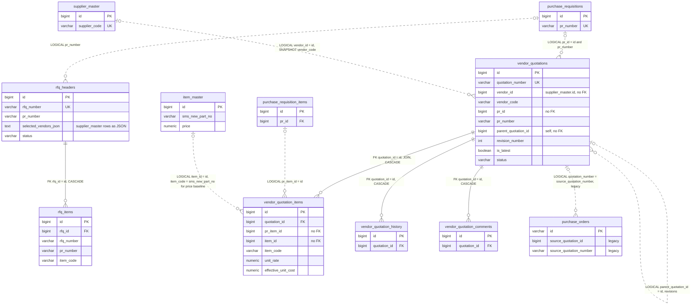
```mermaid
erDiagram
  purchase_requisitions {
    bigint id PK
    varchar pr_number UK
  }
  purchase_requisition_items {
    bigint id PK
    bigint pr_id FK
  }
  rfq_headers {
    bigint id PK
    varchar rfq_number UK
    varchar pr_number
    text selected_vendors_json "supplier_master rows as JSON"
    varchar status
  }
  rfq_items {
    bigint id PK
    bigint rfq_id FK
    varchar rfq_number
    varchar pr_number
    varchar item_code
  }
  vendor_quotations {
    bigint id PK
    varchar quotation_number UK
    bigint vendor_id "supplier_master.id, no FK"
    varchar vendor_code
    bigint pr_id "no FK"
    varchar pr_number
    bigint parent_quotation_id "self, no FK"
    int revision_number
    boolean is_latest
    varchar status
  }
  vendor_quotation_items {
    bigint id PK
    bigint quotation_id FK
    bigint pr_item_id "no FK"
    bigint item_id "no FK"
    varchar item_code
    numeric unit_rate
    numeric effective_unit_cost
  }
  vendor_quotation_history {
    bigint id PK
    bigint quotation_id FK
  }
  vendor_quotation_comments {
    bigint id PK
    bigint quotation_id FK
  }
  supplier_master {
    bigint id PK
    varchar supplier_code UK
  }
  item_master {
    bigint id PK
    varchar sms_new_part_no
    numeric price
  }
  purchase_orders {
    varchar id PK
    bigint source_quotation_id "legacy"
    varchar source_quotation_number "legacy"
  }

  rfq_headers ||--o{ rfq_items : "FK rfq_id = id, CASCADE"
  vendor_quotations ||--o{ vendor_quotation_items : "FK quotation_id = id, JOIN, CASCADE"
  vendor_quotations ||--o{ vendor_quotation_history : "FK quotation_id = id, CASCADE"
  vendor_quotations ||--o{ vendor_quotation_comments : "FK quotation_id = id, CASCADE"
  vendor_quotations |o..o{ vendor_quotations : "LOGICAL parent_quotation_id = id, revisions"
  purchase_requisitions |o..o{ rfq_headers : "LOGICAL pr_number"
  purchase_requisitions |o..o{ vendor_quotations : "LOGICAL pr_id = id and pr_number"
  purchase_requisition_items |o..o{ vendor_quotation_items : "LOGICAL pr_item_id = id"
  supplier_master |o..o{ vendor_quotations : "LOGICAL vendor_id = id, SNAPSHOT vendor_code"
  item_master |o..o{ vendor_quotation_items : "LOGICAL item_id = id, item_code = sms_new_part_no for price baseline"
  vendor_quotations |o..o{ purchase_orders : "LOGICAL quotation_number = source_quotation_number, legacy"
```

`rfq_headers` and `vendor_quotations` have **no direct key** between them. They meet only through `pr_number` (an indirect relationship). The RFQ screen matches bids to invited vendors in the browser by `vendorName` / `vendorId`.

---

## 9. Capital PO

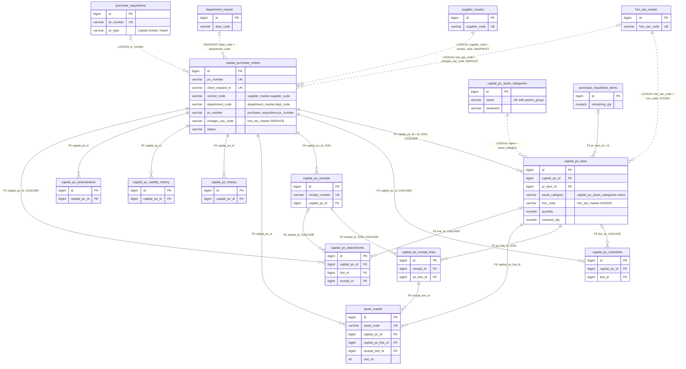
```mermaid
erDiagram
  capital_purchase_orders {
    bigint id PK
    varchar po_number UK
    varchar client_request_id UK
    varchar vendor_code "supplier_master.supplier_code"
    varchar department_code "department_master.dept_code"
    varchar pr_number "purchase_requisitions.pr_number"
    varchar charges_sac_code "hsn_tax_master SERVICE"
    varchar status
  }
  capital_po_lines {
    bigint id PK
    bigint capital_po_id FK
    bigint pr_item_id FK
    varchar asset_category "capital_po_asset_categories.name"
    varchar hsn_code "hsn_tax_master GOODS"
    numeric quantity
    numeric received_qty
  }
  capital_po_asset_categories {
    bigint id PK
    varchar name "UK with parent_group"
    varchar treatment
  }
  capital_po_schedules {
    bigint id PK
    bigint capital_po_id FK
    bigint line_id FK
  }
  capital_po_receipts {
    bigint id PK
    varchar receipt_number UK
    bigint capital_po_id FK
  }
  capital_po_receipt_lines {
    bigint id PK
    bigint receipt_id FK
    bigint po_line_id FK
  }
  asset_master {
    bigint id PK
    varchar asset_code UK
    bigint capital_po_id FK
    bigint capital_po_line_id FK
    bigint receipt_line_id FK
    int unit_no
  }
  capital_po_history {
    bigint id PK
    bigint capital_po_id FK
  }
  capital_po_validity_history {
    bigint id PK
    bigint capital_po_id FK
  }
  capital_po_amendments {
    bigint id PK
    bigint capital_po_id FK
  }
  capital_po_attachments {
    bigint id PK
    bigint capital_po_id FK
    bigint line_id FK
    bigint receipt_id FK
  }
  purchase_requisition_items {
    bigint id PK
    numeric remaining_qty
  }
  purchase_requisitions {
    bigint id PK
    varchar pr_number UK
    varchar pr_type "Capital Goods / Asset"
  }
  supplier_master {
    bigint id PK
    varchar supplier_code UK
  }
  department_master {
    bigint id PK
    varchar dept_code
  }
  hsn_tax_master {
    bigint id PK
    varchar hsn_sac_code UK
  }

  capital_purchase_orders ||--o{ capital_po_lines : "FK capital_po_id = id, JOIN, CASCADE"
  purchase_requisition_items |o--o{ capital_po_lines : "FK pr_item_id = id"
  capital_purchase_orders ||--o{ capital_po_schedules : "FK capital_po_id, CASCADE"
  capital_po_lines |o--o{ capital_po_schedules : "FK line_id, CASCADE"
  capital_purchase_orders ||--o{ capital_po_receipts : "FK capital_po_id, JOIN"
  capital_po_receipts ||--o{ capital_po_receipt_lines : "FK receipt_id, JOIN, CASCADE"
  capital_po_lines ||--o{ capital_po_receipt_lines : "FK po_line_id, JOIN"
  capital_purchase_orders ||--o{ asset_master : "FK capital_po_id"
  capital_po_lines ||--o{ asset_master : "FK capital_po_line_id"
  capital_po_receipt_lines ||--o{ asset_master : "FK receipt_line_id"
  capital_purchase_orders ||--o{ capital_po_history : "FK capital_po_id"
  capital_purchase_orders ||--o{ capital_po_validity_history : "FK capital_po_id"
  capital_purchase_orders ||--o{ capital_po_amendments : "FK capital_po_id"
  capital_purchase_orders ||--o{ capital_po_attachments : "FK capital_po_id, CASCADE"
  capital_po_lines |o--o{ capital_po_attachments : "FK line_id, CASCADE"
  capital_po_receipts |o--o{ capital_po_attachments : "FK receipt_id, CASCADE"
  capital_po_asset_categories ||..o{ capital_po_lines : "LOGICAL name = asset_category"
  hsn_tax_master ||..o{ capital_po_lines : "LOGICAL hsn_sac_code = hsn_code, GOODS"
  hsn_tax_master |o..o{ capital_purchase_orders : "LOGICAL hsn_sac_code = charges_sac_code, SERVICE"
  supplier_master ||..o{ capital_purchase_orders : "LOGICAL supplier_code = vendor_code, SNAPSHOT"
  department_master |o..o{ capital_purchase_orders : "SNAPSHOT dept_code = department_code"
  purchase_requisitions |o..o{ capital_purchase_orders : "LOGICAL pr_number"
```

Capital PO availability is `purchase_requisition_items.remaining_qty − Σ capital_po_lines.quantity` (POs not in DRAFT / REJECTED / CANCELLED). Capital PO does **not** change `ordered_qty`. Receipts never touch `goods_receipt_notes`; fixed assets go to `asset_master`.

---

## 10. Service PO

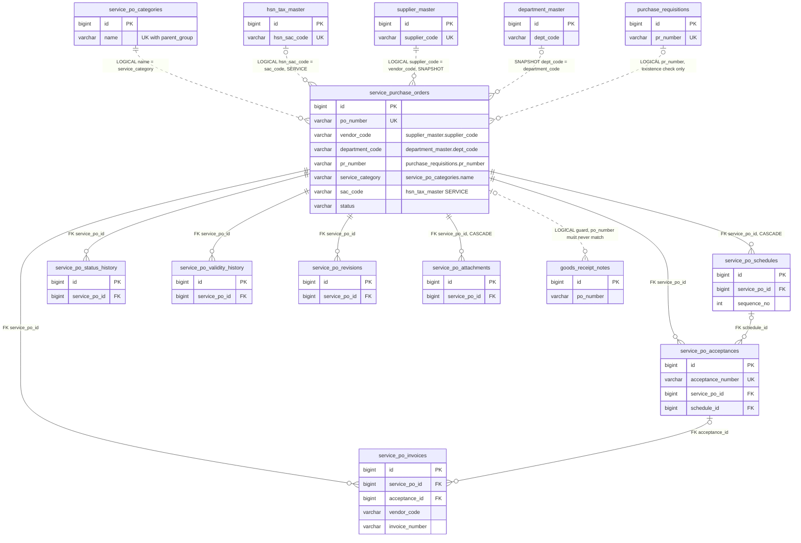
```mermaid
erDiagram
  service_purchase_orders {
    bigint id PK
    varchar po_number UK
    varchar vendor_code "supplier_master.supplier_code"
    varchar department_code "department_master.dept_code"
    varchar pr_number "purchase_requisitions.pr_number"
    varchar service_category "service_po_categories.name"
    varchar sac_code "hsn_tax_master SERVICE"
    varchar status
  }
  service_po_categories {
    bigint id PK
    varchar name "UK with parent_group"
  }
  service_po_schedules {
    bigint id PK
    bigint service_po_id FK
    int sequence_no
  }
  service_po_acceptances {
    bigint id PK
    varchar acceptance_number UK
    bigint service_po_id FK
    bigint schedule_id FK
  }
  service_po_invoices {
    bigint id PK
    bigint service_po_id FK
    bigint acceptance_id FK
    varchar vendor_code
    varchar invoice_number
  }
  service_po_status_history {
    bigint id PK
    bigint service_po_id FK
  }
  service_po_validity_history {
    bigint id PK
    bigint service_po_id FK
  }
  service_po_revisions {
    bigint id PK
    bigint service_po_id FK
  }
  service_po_attachments {
    bigint id PK
    bigint service_po_id FK
  }
  supplier_master {
    bigint id PK
    varchar supplier_code UK
  }
  department_master {
    bigint id PK
    varchar dept_code
  }
  hsn_tax_master {
    bigint id PK
    varchar hsn_sac_code UK
  }
  purchase_requisitions {
    bigint id PK
    varchar pr_number UK
  }
  goods_receipt_notes {
    bigint id PK
    varchar po_number
  }

  service_purchase_orders ||--o{ service_po_schedules : "FK service_po_id, CASCADE"
  service_purchase_orders ||--o{ service_po_acceptances : "FK service_po_id"
  service_po_schedules |o--o{ service_po_acceptances : "FK schedule_id"
  service_purchase_orders ||--o{ service_po_invoices : "FK service_po_id"
  service_po_acceptances |o--o{ service_po_invoices : "FK acceptance_id"
  service_purchase_orders ||--o{ service_po_status_history : "FK service_po_id"
  service_purchase_orders ||--o{ service_po_validity_history : "FK service_po_id"
  service_purchase_orders ||--o{ service_po_revisions : "FK service_po_id"
  service_purchase_orders ||--o{ service_po_attachments : "FK service_po_id, CASCADE"
  service_po_categories ||..o{ service_purchase_orders : "LOGICAL name = service_category"
  hsn_tax_master |o..o{ service_purchase_orders : "LOGICAL hsn_sac_code = sac_code, SERVICE"
  supplier_master ||..o{ service_purchase_orders : "LOGICAL supplier_code = vendor_code, SNAPSHOT"
  department_master |o..o{ service_purchase_orders : "SNAPSHOT dept_code = department_code"
  purchase_requisitions |o..o{ service_purchase_orders : "LOGICAL pr_number, existence check only"
  service_purchase_orders |o..o{ goods_receipt_notes : "LOGICAL guard, po_number must never match"
```

---

## 11. Numbering and audit

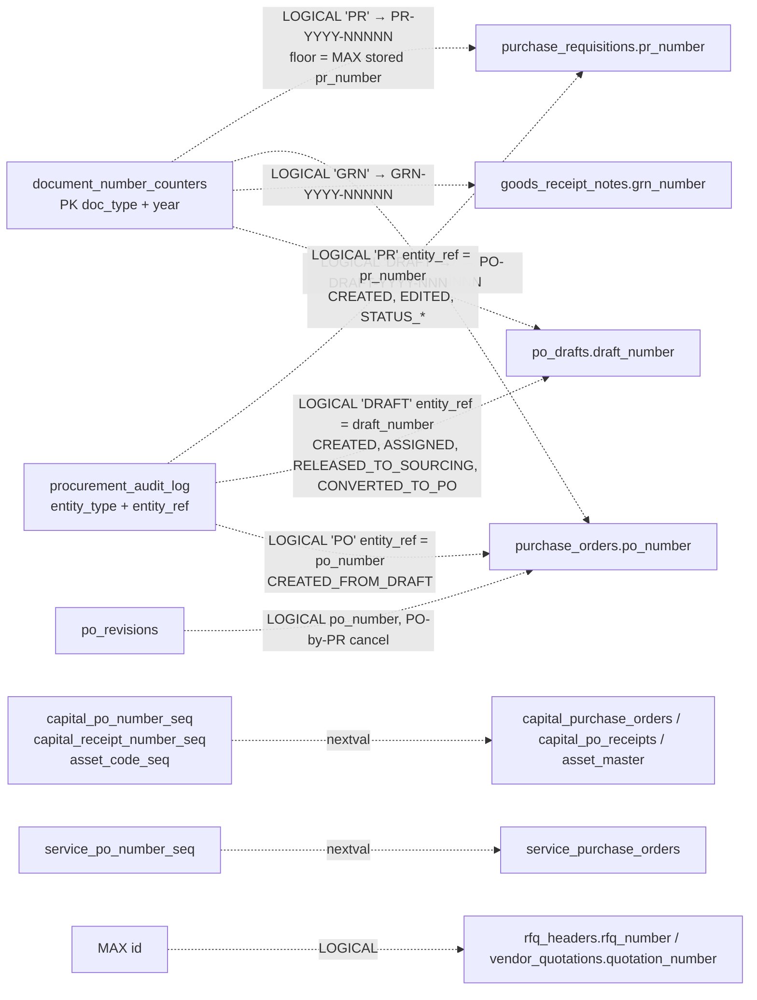
```mermaid
flowchart LR
  DNC["document_number_counters<br/>PK doc_type + year"]
  DNC -. "LOGICAL 'PR' → PR-YYYY-NNNNN<br/>floor = MAX stored pr_number" .-> PR[purchase_requisitions.pr_number]
  DNC -. "LOGICAL 'PO' → PO-YYYY-NNNNN" .-> PO[purchase_orders.po_number]
  DNC -. "LOGICAL 'GRN' → GRN-YYYY-NNNNN" .-> GRN[goods_receipt_notes.grn_number]
  DNC -. "LOGICAL 'DRAFT' → DRAFT-YYYY-NNN" .-> PD[po_drafts.draft_number]
  SEQ1["capital_po_number_seq<br/>capital_receipt_number_seq<br/>asset_code_seq"] -. "nextval" .-> CAP[capital_purchase_orders / capital_po_receipts / asset_master]
  SEQ2["service_po_number_seq"] -. "nextval" .-> SPO[service_purchase_orders]
  MAXID["MAX id"] -. "LOGICAL" .-> RFQ[rfq_headers.rfq_number / vendor_quotations.quotation_number]

  PAL["procurement_audit_log<br/>entity_type + entity_ref"]
  PAL -. "LOGICAL 'PR' entity_ref = pr_number<br/>CREATED, EDITED, STATUS_*" .-> PR
  PAL -. "LOGICAL 'DRAFT' entity_ref = draft_number<br/>CREATED, ASSIGNED, RELEASED_TO_SOURCING, CONVERTED_TO_PO" .-> PD
  PAL -. "LOGICAL 'PO' entity_ref = po_number<br/>CREATED_FROM_DRAFT" .-> PO
  POREV["po_revisions"] -. "LOGICAL po_number, PO-by-PR cancel" .-> PO
```

---

## 12. Reporting flows

Each diagram shows the tables a report reads and the exact JOIN keys (`ProcurementReportService.java` unless noted).

### 12.1 PR Tracking / Traceability: `/api/new-po/reports/traceability`, `/pr-status/{pr}`

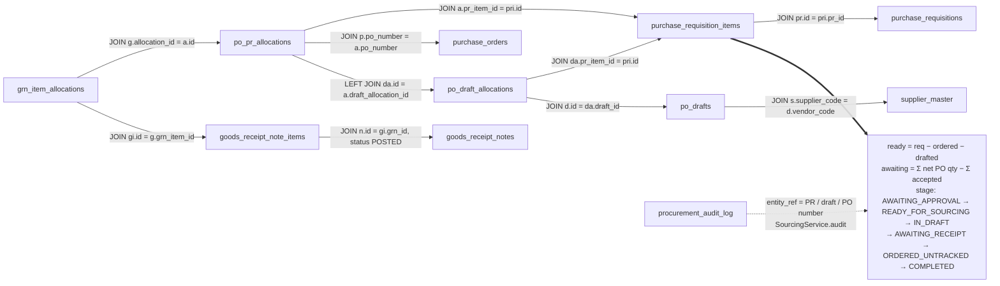
```mermaid
flowchart LR
  PRI[purchase_requisition_items] -- "JOIN pr.id = pri.pr_id" --> PR[purchase_requisitions]
  PDA[po_draft_allocations] -- "JOIN da.pr_item_id = pri.id" --> PRI
  PDA -- "JOIN d.id = da.draft_id" --> PD[po_drafts]
  PD -- "JOIN s.supplier_code = d.vendor_code" --> SM[supplier_master]
  PPA[po_pr_allocations] -- "JOIN a.pr_item_id = pri.id" --> PRI
  PPA -- "JOIN p.po_number = a.po_number" --> PO[purchase_orders]
  PPA -- "LEFT JOIN da.id = a.draft_allocation_id" --> PDA
  GIA[grn_item_allocations] -- "JOIN g.allocation_id = a.id" --> PPA
  GIA -- "JOIN gi.id = g.grn_item_id" --> GRNI[goods_receipt_note_items]
  GRNI -- "JOIN n.id = gi.grn_id, status POSTED" --> GRN[goods_receipt_notes]
  PRI ==> CALC["ready = req − ordered − drafted<br/>awaiting = Σ net PO qty − Σ accepted<br/>stage: AWAITING_APPROVAL → READY_FOR_SOURCING → IN_DRAFT<br/>→ AWAITING_RECEIPT → ORDERED_UNTRACKED → COMPLETED"]
  PAL[procurement_audit_log] -. "entity_ref = PR / draft / PO number<br/>SourcingService.audit" .-> CALC
```

### 12.2 PO vs PR: `/reports/po-vs-pr`

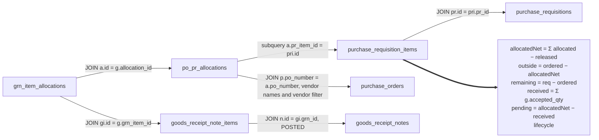
```mermaid
flowchart LR
  PRI[purchase_requisition_items] -- "JOIN pr.id = pri.pr_id" --> PR[purchase_requisitions]
  PPA[po_pr_allocations] -- "subquery a.pr_item_id = pri.id" --> PRI
  PPA -- "JOIN p.po_number = a.po_number, vendor names and vendor filter" --> PO[purchase_orders]
  GIA[grn_item_allocations] -- "JOIN a.id = g.allocation_id" --> PPA
  GIA -- "JOIN gi.id = g.grn_item_id" --> GRNI[goods_receipt_note_items]
  GRNI -- "JOIN n.id = gi.grn_id, POSTED" --> GRN[goods_receipt_notes]
  PRI ==> C["allocatedNet = Σ allocated − released<br/>outside = ordered − allocatedNet<br/>remaining = req − ordered<br/>received = Σ g.accepted_qty<br/>pending = allocatedNet − received<br/>lifecycle"]
```

### 12.3 PR vs PO vs MRN/GRN: `/reports/po-vs-pr-vs-grn`

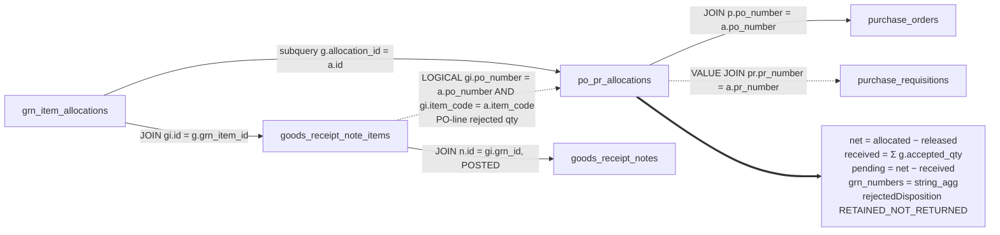
```mermaid
flowchart LR
  PPA[po_pr_allocations] -- "JOIN p.po_number = a.po_number" --> PO[purchase_orders]
  PPA -. "VALUE JOIN pr.pr_number = a.pr_number" .-> PR[purchase_requisitions]
  GIA[grn_item_allocations] -- "subquery g.allocation_id = a.id" --> PPA
  GIA -- "JOIN gi.id = g.grn_item_id" --> GRNI[goods_receipt_note_items]
  GRNI -- "JOIN n.id = gi.grn_id, POSTED" --> GRN[goods_receipt_notes]
  GRNI -. "LOGICAL gi.po_number = a.po_number AND gi.item_code = a.item_code<br/>PO-line rejected qty" .-> PPA
  PPA ==> C["net = allocated − released<br/>received = Σ g.accepted_qty<br/>pending = net − received<br/>grn_numbers = string_agg<br/>rejectedDisposition RETAINED_NOT_RETURNED"]
```

### 12.4 PR vs PO: `/reports/pr-vs-po` and `/reports/pr-vs-po/item-summary`

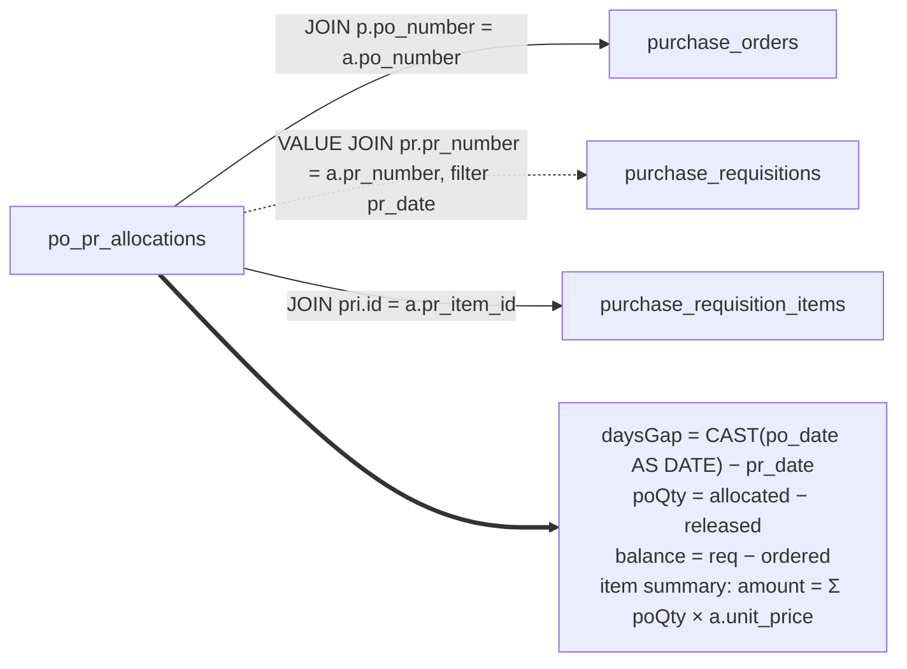
```mermaid
flowchart LR
  PPA[po_pr_allocations] -- "JOIN p.po_number = a.po_number" --> PO[purchase_orders]
  PPA -. "VALUE JOIN pr.pr_number = a.pr_number, filter pr_date" .-> PR[purchase_requisitions]
  PPA -- "JOIN pri.id = a.pr_item_id" --> PRI[purchase_requisition_items]
  PPA ==> C["daysGap = CAST(po_date AS DATE) − pr_date<br/>poQty = allocated − released<br/>balance = req − ordered<br/>item summary: amount = Σ poQty × a.unit_price"]
```

### 12.5 Legacy Reconciliation: `/reports/legacy-reconciliation`

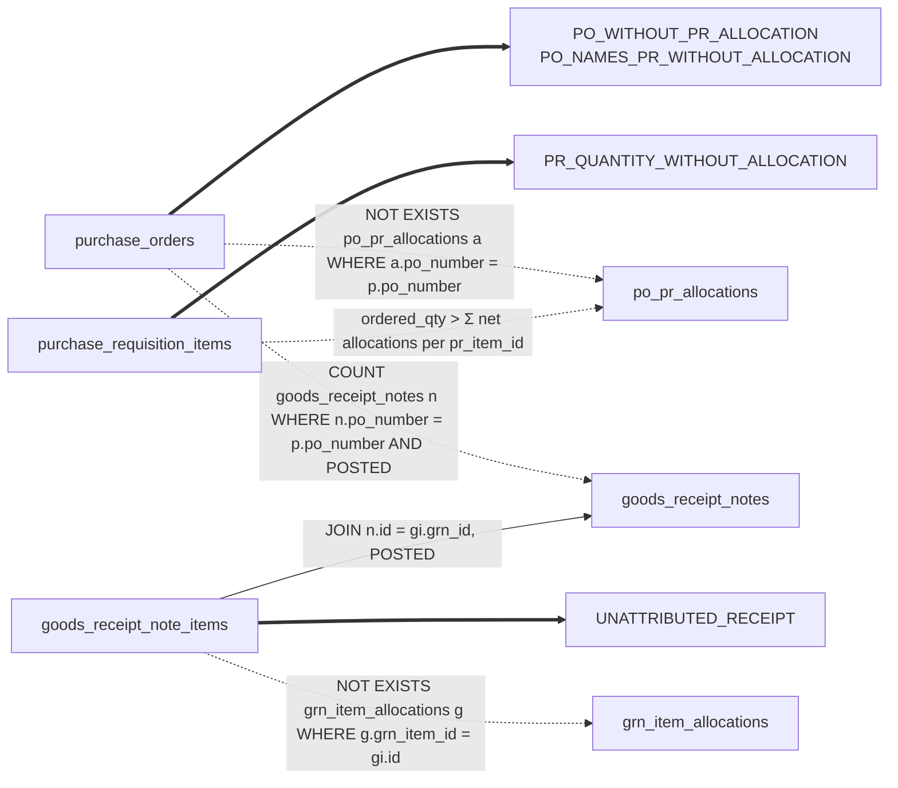
```mermaid
flowchart LR
  PO[purchase_orders] -. "NOT EXISTS po_pr_allocations a WHERE a.po_number = p.po_number" .-> PPA[po_pr_allocations]
  PO -. "COUNT goods_receipt_notes n WHERE n.po_number = p.po_number AND POSTED" .-> GRN[goods_receipt_notes]
  GRNI[goods_receipt_note_items] -- "JOIN n.id = gi.grn_id, POSTED" --> GRN
  GRNI -. "NOT EXISTS grn_item_allocations g WHERE g.grn_item_id = gi.id" .-> GIA[grn_item_allocations]
  PRI[purchase_requisition_items] -. "ordered_qty > Σ net allocations per pr_item_id" .-> PPA
  PO ==> O1["PO_WITHOUT_PR_ALLOCATION<br/>PO_NAMES_PR_WITHOUT_ALLOCATION"]
  GRNI ==> O2["UNATTRIBUTED_RECEIPT"]
  PRI ==> O3["PR_QUANTITY_WITHOUT_ALLOCATION"]
```

### 12.6 PO Register and PO detail: `/reports/all-purchase-orders`, `/pr/purchase-orders/{po}`

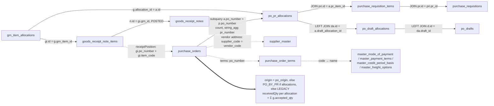
```mermaid
flowchart LR
  PO[purchase_orders] -- "subquery a.po_number = p.po_number<br/>count, string_agg pr_number" --> PPA[po_pr_allocations]
  PPA -- "JOIN pri.id = a.pr_item_id" --> PRI[purchase_requisition_items]
  PRI -- "JOIN pr.id = pri.pr_id" --> PR[purchase_requisitions]
  PPA -- "LEFT JOIN da.id = a.draft_allocation_id" --> PDA[po_draft_allocations]
  PDA -- "LEFT JOIN d.id = da.draft_id" --> PD[po_drafts]
  GIA[grn_item_allocations] -- "g.allocation_id = a.id" --> PPA
  GIA -- "gi.id = g.grn_item_id" --> GRNI[goods_receipt_note_items]
  GRNI -- "n.id = gi.grn_id, POSTED" --> GRN[goods_receipt_notes]
  GRNI -. "receiptPosition: gi.po_number + gi.item_code" .-> PO
  PO -. "vendor address: supplier_code = vendor_code" .-> SM[supplier_master]
  PO -. "terms: po_number" .-> POT[purchase_order_terms]
  POT -. "code → name" .-> MST["master_mode_of_payment / master_payment_terms /<br/>master_credit_period_basis / master_freight_options"]
  PO ==> C["origin = po_origin, else PO_BY_PR if allocations, else LEGACY<br/>receivedQty per allocation = Σ g.accepted_qty"]
```

### 12.7 GRN pending POs: `/api/purchase/grn/pending-pos` (`GoodsReceiptNoteService`)

```mermaid
flowchart LR
  CACHE["PurchaseProcessingService in-memory PO cache<br/>loaded from purchase_orders"] --> PO[purchase_orders.details_json lines]
  PPA[po_pr_allocations] -. "GROUP BY po_number, string_agg pr_number" .-> PO
  GRNI[goods_receipt_note_items] -. "po_number + item_code, grn_id IN POSTED" .-> PO
  GRNI -- "grn_id → goods_receipt_notes.id" --> GRN[goods_receipt_notes]
  PO ==> C["balance = ordered − Σ accepted<br/>excludes CANCELLED, COMPLETED"]
```

### 12.8 Quotation analytics: `/api/purchase/quotations/*` (`VendorQuotationService`)

```mermaid
flowchart LR
  VQI[vendor_quotation_items] -- "JOIN q.id = it.quotation_id" --> VQ[vendor_quotations]
  VQ ==> SUM["summary: counts on is_latest quotations"]
  VQI ==> CMP["comparison: item_code, is_latest<br/>cost for qty = effective_unit_cost × required qty<br/>diff% from lowest"]
  IM[item_master] -. "price WHERE sms_new_part_no = item_code<br/>baseline when no earlier quote" .-> CMP
  VQI ==> HIST["price-history: by item_code, vendor_code<br/>ORDER BY quotation_date, revision"]
  VQ ==> VA["vendor-analysis GROUP BY vendor_code<br/>selectionRate = selected / submitted × 100<br/>Σ final_amount, distinct items"]
```
